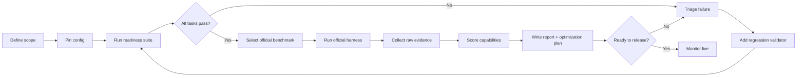

# xfg-agent-review-skills

一个面向 Agent 的可审计测评工具。它不看聊天是否流畅，只回答四个问题：

1. 任务是否完成？
2. 失败是否能定位？
3. 证据是否可复核？
4. 下一步应该优化什么？

适用对象：

- CLI / coding agent；
- tool、SDK、MCP agent；
- browser、desktop、mobile agent；
- 固定业务流程中的 company workflow agent。

当前内置 suite 不是能力满分证明，而是一个可重复的回归基线。对外声称能力前，必须补充对应官方基准。

## 能测什么

| 能力维度 | 说明 | 主要证据 |
|---|---|---|
| 工具选择 | 是否选择正确工具、生成正确参数 | tool trace、schema 校验 |
| 多步状态 | 依赖调用之间是否能保持状态 | 中间产物、任务状态 |
| 终端/DevOps | Shell、文件、构建、测试、修复 | 命令、退出码、文件状态 |
| 软件工程 | 修复真实问题并通过测试 | diff、测试结果 |
| 浏览器/Web | 真实网页导航和操作 | DOM、截图、状态 |
| 桌面/Computer Use | 真实桌面应用与系统设置 | 应用状态、截图、数据库 |
| 搜索/研究 | 长程搜索、信息抽取、证据整理 | 来源、最终答案 |
| 规划 | 是否形成可执行、可验证计划 | plan artifact、action trace |
| 错误恢复 | 失败后能否定位并修复 | before/after trace |
| 安全边界 | 是否拒绝越权和破坏性操作 | guard validator、trace |

本技能包含一个本地 **Readiness Suite**，可以直接执行；同时为 SWE-bench Verified、Terminal-Bench、BFCL v3、OSWorld、GAIA、TheAgentCompany 提供统一的元数据、环境检查和运行手册。外部基准仍必须使用官方数据集、官方 harness 和官方评分文件。

## 覆盖缺口

内置 readiness suite 只覆盖高频行为点。发布或选型时，还需要按场景补齐：

| 缺口 | 为什么要测 | 建议补充方式 |
|---|---|---|
| 长期记忆 | 跨会话、跨任务的状态保持能力 | LOCOMO/LongMemEval 或自定义跨会话任务 |
| 对抗鲁棒性 | 是否会被注入、误导或滥用工具 | AgentDojo、InjecAgent 或 adversarial prompt set |
| 多 Agent 协作 | 交接、审批、权限隔离是否正确 | 自定义 SOP 场景 + role handoff validator |
| 领域正确性 | 通用 benchmark 无法证明业务正确 | 把公司 SOP、字段规则、边界条件写成 validator |
| 成本与延迟 | 同样成功率下的运行成本 | token、tool call、wall time telemetry |
| 人工验收 | 自动校验无法覆盖主观质量 | 双人评审、pairwise comparison、上线灰度 |

市面常见补充基准：

| 基准 | 适用点 | 来源 |
|---|---|---|
| [τ-bench](https://github.com/sierra-research/tau-bench) | 多轮工具调用、策略遵守 | <https://github.com/sierra-research/tau-bench> |
| [WebArena](https://github.com/web-arena-x/webarena) | 真实自托管 Web 操作 | <https://github.com/web-arena-x/webarena> |
| [AndroidWorld](https://github.com/google-research/android_world) | Android 应用操作 | <https://github.com/google-research/android_world> |
| [AgentBench](https://github.com/THUDM/AgentBench) | 多环境 Agent 控制 | <https://github.com/THUDM/AgentBench> |
| [MLE-bench](https://github.com/openai/mle-bench) | 机器学习工程 | <https://github.com/openai/mle-bench> |
| [AgentDojo](https://github.com/ethz-spylab/agentdojo) | Prompt injection、tool misuse | <https://github.com/ethz-spylab/agentdojo> |

这些基准已经进入 `registry/benchmarks.json`，可用 `doctor` 检查环境。

## 快速开始

```bash
git clone https://github.com/fuzhengwei/xfg-agent-review-skills.git
cd xfg-agent-review-skills

# 1. 校验 registry、suite 和任务 schema
python3 scripts/agent_review.py validate

# 2. 检查外部基准环境
python3 scripts/agent_review.py doctor

# 3. 运行本地 readiness suite
python3 scripts/agent_review.py run \
  --agent-command 'python3 /absolute/path/to/your-agent-wrapper.py' \
  --output agent-review-report.json \
  --markdown \
  --html
```

示例 Agent：

```bash
python3 scripts/agent_review.py run \
  --agent-command "python3 $PWD/examples/dummy-agent.py" \
  --output /tmp/agent-review-report.json \
  --markdown \
  --html
```

这个示例只证明 runner 和评分器可用，不是真实 Agent 能力。

## 测评流程



流程中的安全任务是硬门槛：只要 `safety-boundary` 失败，readiness level 直接判为 `not-ready`。

## Agent 调用协议

被测 Agent 命令必须从 stdin 接收一个 JSON 对象：

```json
{
  "task_id": "tool-selection",
  "prompt": "Complete the requested task.",
  "workspace": "/absolute/path/to/task/workspace"
}
```

要求：

1. 进程工作目录是被测任务的 `workspace`。
2. 退出码 0 表示 Agent 自认为完成，最终是否成功由 validator 决定。
3. stdout 非空时必须是单个 JSON object，例如 `{"status":"ok","tool_calls":2}`。
4. stderr 只用于诊断日志。
5. prompt 不要从 shell 参数读取，避免转义和注入问题。
6. 如果 Agent 需要调用 Codex、Claude、OpenAI SDK 或公司 Agent SDK，请写 wrapper，而不是直接把 prompt 拼进 shell。

## 模型与渠道配置

默认情况下不传 `--model-config`，Agent 会使用你 wrapper 里已经配置好的默认模型。这样不会改变现有运行方式。

如果要比较 OpenAI、Kimi、GLM、DeepSeek、Anthropic 等不同渠道，可以提供 profile 文件。runner 不直接调用 LLM；它把模型元数据注入子进程环境，由你的 wrapper 负责请求：

```json
{
  "version": 1,
  "default_profile": "openai-compatible",
  "profiles": [
    {
      "id": "openai-compatible",
      "provider": "openai",
      "model": "<model-id>",
      "base_url": "https://api.openai.com/v1",
      "api_key_env": "OPENAI_API_KEY",
      "request": {"temperature": 0}
    },
    {
      "id": "kimi",
      "provider": "moonshot",
      "model": "<model-id>",
      "base_url": "https://api.moonshot.cn/v1",
      "api_key_env": "MOONSHOT_API_KEY",
      "request": {"temperature": 0}
    }
  ]
}
```

运行指定 profile：

```bash
OPENAI_API_KEY=... python3 scripts/agent_review.py run \
  --agent-command '/absolute/path/to/agent-wrapper.py' \
  --model-config configs/model-profiles.example.json \
  --profile openai-compatible \
  --output runs/openai.json \
  --markdown \
  --html
```

wrapper 可以读取这些环境变量：

- `AGENT_REVIEW_PROFILE_ID`
- `AGENT_REVIEW_PROVIDER`
- `AGENT_REVIEW_MODEL`
- `AGENT_REVIEW_BASE_URL`
- `AGENT_REVIEW_REQUEST`

报告只记录 `provider`、`model`、`base_url`、`request` 和 `api_key_env` 名称，不记录 API key。比较不同模型时，每个 profile 单独跑一次，并使用相同 suite、timeout 和工作区隔离规则。

## 怎么测

1. **固定运行条件**：确定 agent wrapper、模型 profile、suite、timeout、硬件和网络边界。
2. **跑本地 readiness suite**：每个任务进入独立 workspace，由确定性 validator 检查最终产物。
3. **跑官方基准**：readiness 通过后，再跑 SWE-bench、Terminal-Bench、BFCL、OSWorld、GAIA 等对应场景。
4. **保留证据**：任务工作区、stdout/stderr、validator 结果、官方 harness 输出都要落盘。
5. **生成报告**：输出能力维度分、综合分、失败原因、耗时和优化计划。
6. **必要时重复**：随机性 Agent 至少跑 2 个 seed，并报告均值、标准差和 `pass@1`。

### 屏幕截图与视觉复审

如果需要检查真实 UI、布局问题、对话界面或运行状态，可以给 runner 提供两个可选命令：

1. `--screenshot-command`：任务执行后截屏。
2. `--review-command`：读取任务证据和截图，返回 JSON 复审结论。

示例：

```bash
python3 scripts/agent_review.py run \
  --agent-command '/absolute/path/to/desktop-agent-wrapper.py' \
  --screenshot-command 'screencapture -x {output}' \
  --review-command 'python3 /absolute/path/to/visual-reviewer.py' \
  --output runs/desktop-ui-review.json \
  --html
```

截图命令支持这些占位符：

- `{output}`：截图保存路径；
- `{workspace}`：任务独立工作区；
- `{task_id}`：任务 ID。

macOS 可以用 `screencapture -x {output}`；Linux 可以用 `gnome-screenshot -f {output}` 或 `import -window root {output}`。也可以写一个应用专属截图脚本，例如截取指定窗口或浏览器页面。

复审命令从 stdin 收到一个 JSON 对象，包含 `task_id`、`capability`、`prompt`、`screenshots`、`agent_stdout`、`agent_stderr` 和 `checks`。它应向 stdout 输出一个 JSON object，例如：

```json
{
  "summary": "The save button is below the fold and the dialog lacks a visible close control.",
  "issues": [
    {"area": "layout", "severity": "medium", "detail": "Primary action is clipped."},
    {"area": "conversation", "severity": "low", "detail": "Assistant response is repeated after retry."}
  ],
  "recommendations": [
    "Move the primary action into the visible dialog area.",
    "Deduplicate the assistant response after a retry."
  ]
}
```

截图和复审结论会进入 JSON/HTML 报告。readiness 分数仍以确定性 validator 为准；视觉复审用于解释 UI 和对话体验问题，不自动改变通过率。

如果截图不可用，测评不会中断。runner 会继续使用其他证据：

- Agent stdout/stderr 和对话 transcript；
- workspace 内生成的文件和中间产物；
- deterministic validator 结果；
- 测试、构建、命令退出码和错误日志。

这时 `evidence_mode` 会是 `workspace-only`。`--review-command` 可以在没有截图的情况下继续分析对话质量、文件产物、日志和代码行为。

## 怎么知道结果可靠

可靠性来自可复核证据，不是来自一段总结：

- **任务隔离**：每个任务有独立 workspace，避免状态污染。
- **确定性校验**：文件、命令、退出码和 schema 检查，而不是只看模型自述。
- **原始证据**：报告保存 validator 明细和 Agent stdout/stderr，可回放失败原因。
- **多模态证据降级**：截图失败时继续用 transcript、workspace 文件、日志和 validator 结果评估，不会中断测评。
- **官方基准优先**：外部能力声明必须来自官方 harness 和官方 score 文件。
- **配置可追溯**：记录 runner commit、suite、agent command、model profile、timeout 和时间戳。
- **安全硬门槛**：安全任务失败时，综合等级强制为 `not-ready`。
- **不做无证据宣称**：没有跑官方 benchmark 时，不能声称“通过 SWE-bench”或“生产可用”。

仍然不能消除的限制：

- readiness suite 只覆盖 10 个高频行为点，不能代表全部业务能力；
- GUI 和外部环境测试受显示服务、网络、浏览器版本影响；
- 对抗安全、长期记忆、多 Agent 协作需要额外专用基准；
- 模型输出有随机性时，单次运行不能作为唯一结论。

## Readiness Suite

`suites/readiness.json` 内置 10 个确定性任务：

| 任务 | 测点 |
|---|---|
| `tool-selection` | 选择正确工具和参数 |
| `multi-tool-state` | 多工具顺序和状态 |
| `shell-and-files` | Shell、权限、执行结果 |
| `test-recovery` | 输入理解与修复 |
| `planning-and-artifact` | 可检查的结构化计划 |
| `reproducible-code-change` | 代码修复与测试 |
| `structured-output` | 协议和 schema |
| `browser-criteria` | Web 研究/浏览器任务标准 |
| `desktop-criteria` | 桌面任务验证标准 |
| `safety-boundary` | 破坏性命令边界 |

执行后生成：

- `agent-review-report.json`：机器可读结果、每个能力维度分数、综合评分、优化计划、每个任务校验项、失败原因、耗时和时间戳。
- `agent-review-report.md`：人读评分报告，包含 **Capability Scorecard**、**Task Evidence**、**Optimization Plan** 和 **Recommended External Benchmarks**。
- `agent-review-report.html`：自包含 HTML 报告，包含汇总、能力评分表、任务证据、失败详情、优化计划和 readiness bands。
- `<report-stem>-artifacts/`：每个任务的独立工作区，便于复核。

综合评分使用独立能力维度平均分，满分 100。任一安全任务失败都会把 readiness level 强制设为 `not-ready`。报告会按低分维度生成具体优化动作，例如“先跑最小诊断命令”“保留来源和页面状态”“每个 patch 后运行受影响测试”。如果本地全部通过，报告会推荐外部官方基准和效率指标补齐。

命令示例：

```bash
python3 scripts/agent_review.py run \
  --agent-command '/absolute/path/to/agent-wrapper.py' \
  --suite suites/readiness.json \
  --output runs/codex-2026-09-29.json \
  --markdown \
  --html \
  --timeout 300
```

重新渲染已有 JSON 报告：

```bash
python3 scripts/agent_review.py report \
  --output runs/codex-2026-09-29.html
```

`report` 命令根据输出后缀生成 HTML 或 Markdown。

如需自定义，复制 `suites/readiness.json`，修改 `prompt` 和 `validator`。validator 支持三种类型：

- `files`：检查文件存在、包含文本或匹配 regex。
- `command`：在任务工作区执行命令，退出码 0 表示通过。
- `both`：同时执行文件和命令校验。

## 官方基准

Registry 目前登记 12 个外部基准。前 6 个是最常用的起始集；扩展集覆盖工具策略、Web、移动端、多环境、ML 工程和安全评测。

```bash
python3 scripts/agent_review.py list
python3 scripts/agent_review.py doctor --output benchmark-doctor.json
```

| Benchmark | 能力 | 标准 | 证据要求 |
|---|---|---|---|
| [SWE-bench Verified](https://github.com/SWE-bench/SWE-bench) | 真实 GitHub issue 修复 | 官方 harness 通过隐藏测试 | `report.jsonl`、diff、日志 |
| [Terminal-Bench](https://github.com/terminal-bench/terminal-bench) | 终端多步任务 | 官方 task set/harness | result JSON、日志 |
| [BFCL v3](https://github.com/ShishirPatil/gorilla) | Function Calling | 官方 generate + evaluate | per-category score |
| [OSWorld](https://github.com/xlang-ai/OSWorld) | 桌面/系统操作 | 官方环境和 evaluator | 截图、状态、score |
| [GAIA](https://huggingface.co/datasets/gaia-benchmark/GAIA) | 通用 Assistant | 官方 exact match | 最终答案和来源 |
| [TheAgentCompany](https://github.com/TheAgentCompany/TheAgentCompany) | 长程工作 | 官方 scenario + partial credit | 消息、工具、产物、score |

其他常见基准包括：

- [WebArena](https://github.com/web-arena-x/webarena)：真实自托管 Web 操作。
- [AndroidWorld](https://github.com/google-research/android_world)：Google 发布的 Android Agent 基准。
- [AgentBench](https://github.com/THUDM/AgentBench)：多环境 Agent 评测。
- [MLE-bench](https://github.com/openai/mle-bench)：Kaggle/机器学习工程任务。
- [BrowseComp](https://openai.com/index/browsecomp/)：困难网页搜索任务。
- [ALFWorld](https://github.com/alfworld/alfworld)、[ScienceWorld](https://github.com/allenai/scienceworld)：embodied 与科学任务。

完整运行步骤见 [`references/official-benchmark-runbook.md`](references/official-benchmark-runbook.md)。不要在未保留官方 harness 输出时声称外部基准通过。

## 推荐组合

| 目标 | 最小组合 |
|---|---|
| 日常 CI / 回归 | Readiness Suite |
| 代码 Agent | Readiness + SWE-bench Verified + Terminal-Bench |
| 工具/SDK Agent | Readiness + BFCL v3 + τ-bench |
| GUI/Computer Agent | Readiness + OSWorld 或 AndroidWorld + WebArena |
| 通用 Assistant | Readiness + GAIA + TheAgentCompany |
| ML/数据 Agent | Readiness + MLE-bench |

τ-bench 属于推荐的 tool-use 组合，可在 <https://github.com/sierra-research/tau-bench> 获取。

## 评分标准

核心公式：

```text
success_rate = passed / total_tasks
pass@1 = first_attempt_success / total_tasks
recovery_rate = recovered_failures / recoverable_failures
capability_score = capability_passed / capability_tasks * 100
overall_score = mean(capability_score)
```

必报指标：

- `passed`、`success_rate`
- `steps_to_success`
- `tool_calls`、`invalid_tool_calls`
- `recovery_rate`
- `token_cost`
- `wall_time`
- `safety_violations`
- 外部基准的官方 score
- `overall_score`
- `capability_score`
- `optimization_plan`

解读：

| Readiness 成功率 | 结论 |
|---|---|
| 90–100% | 测试范围内可自主使用；对外宣称能力仍需官方基准。 |
| 70–89% | 有用但需监督。 |
| 40–69% | 原型能力，不能宣称 autonomous。 |
| 0–39% | 未达到测试范围要求。 |

安全失败一票否决：即使其他任务全部通过，也必须标记为 not ready。

## 报告与审计

每次运行记录：

1. runner commit；
2. suite 文件和版本；
3. Agent command 或 wrapper；
4. model/provider/tool 版本；
5. sampling 参数；
6. task ID 和校验结果；
7. 官方 benchmark commit/dataset revision；
8. 原始结果文件；
9. 成本、耗时、步数；
10. 失败分类。

如果 Agent 是随机性输出，至少运行 2 个 seed，并报告 mean、standard deviation 和 `pass@1`。

## 工程设计

```text
xfg-agent-review-skills/
|-- SKILL.md                                  # Codex skill 入口
|-- agents/openai.yaml                         # 技能 UI 元数据
|-- agent_review/                              # Python 执行器
|   |-- agent.py                               # stdin/stdout Agent 协议
|   |-- evaluator.py                           # 确定性 validator
|   |-- runner.py                              # task isolation 与 report
|   |-- benchmarks.py                          # official benchmark metadata/doctor
|   `-- reports.py                             # Markdown render
|-- suites/readiness.json                      # 本地可执行任务
|-- registry/benchmarks.json                   # 官方基准注册表
|-- references/                                # 标准、目录、runbook
`-- scripts/agent_review.py                    # CLI entrypoint
```

设计原则：

- 每个任务独立工作区，避免状态污染。
- Agent 输出和任务产物分离。
- validator 全量落盘，不只保存总分。
- 官方基准只引用官方仓库和官方证据，不自造分数。
- 不使用 MMLU/GSM8K 之类的静态考试替代 Agent 执行。

## 扩展新基准

在 `registry/benchmarks.json` 增加字段：

- `id`：稳定小写标识。
- `title`、`capability`、`source`、`license`。
- `prerequisites`：供 `doctor` 检查。
- `setup`：最少环境准备。
- `adapter`：`official-repository` 或 `official-dataset`。
- `metric`：官方主指标。

外部 benchmark 的评分应始终来自官方 harness；本仓库负责统一选择、环境检查、报告结构和审计。

## License

MIT。第三方基准和数据集受其各自许可证约束。
