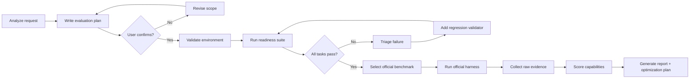

# xfg-agent-review-skills

一个把 Agent 能力转化为可复现任务结果、可审计证据和可执行优化计划的测评工具。

## 理论基础与可靠性模型

本工具不评价“模型像不像聪明”，而是评价 Agent 在受控任务中的可观察行为和最终交付物。方法论来自三个成熟实践：

1. **确定性回归测试**：用文件、命令、退出码、schema 和最终状态判断任务是否完成。
2. **受控基准评测**：固定 Agent 入口、模型配置、suite、timeout、工作区和证据格式，减少环境噪声。
3. **可审计评估**：每项结论都能追溯到 validator 明细、Agent stdout/stderr、任务工作区或官方 benchmark 输出。

可靠性来自四类效度：

| 效度 | 在本工具中的实现 |
|---|---|
| 构念效度 | 测的是任务完成、工具调用、终端操作、代码修复、安全边界，而不是聊天风格。 |
| 内容效度 | 内置 readiness suite 覆盖 10 个高频 Agent 行为；外部 registry 覆盖代码、工具、Web、桌面、移动、长程和安全场景。 |
| 效标效度 | 对外能力声明必须引用 SWE-bench、Terminal-Bench、BFCL、OSWorld、GAIA 等官方 harness 结果。 |
| 测量稳定性 | 每任务独立工作区、固定 timeout、确定性 validator、可重复命令和可追溯配置。 |

结果解释遵守三个限制：

- readiness suite 是回归基线，不是全能能力证明；
- 外部 benchmark 没有真实运行时，不能声称通过；
- 随机性 Agent 需要多 seed 和均值/标准差，单次结果不能定论。

## 评测流程

使用技能时，**先分析，再确认，后执行**。



开始前必须给出一份测试计划，包含：

1. 测评目标；
2. Agent command 或 wrapper；
3. 默认模型或指定 model profile；
4. 要跑的 suite/task/official benchmark；
5. 要采集的证据；
6. 通过/失败标准；
7. 预计耗时、成本和风险；
8. 明确不测什么。

用户确认后才开始执行。确认表达可以是“确认执行”“开始”“批准”。如果用户修改范围，需要重新确认。

## 使用说明

```bash
git clone https://github.com/fuzhengwei/xfg-agent-review-skills.git
cd xfg-agent-review-skills

python3 scripts/agent_review.py validate
python3 scripts/agent_review.py doctor

python3 scripts/agent_review.py run \
  --agent-command 'python3 /absolute/path/to/your-agent-wrapper.py' \
  --output agent-review-report.json \
  --markdown \
  --html
```

示例：

```bash
python3 scripts/agent_review.py run \
  --agent-command "python3 $PWD/examples/dummy-agent.py" \
  --output /tmp/agent-review-report.json \
  --markdown \
  --html
```

示例只验证 runner 和评分器可用，不是真实 Agent 能力。

## Agent 调用协议

被测 Agent 命令从 stdin 接收：

```json
{
  "task_id": "tool-selection",
  "prompt": "Complete the requested task.",
  "workspace": "/absolute/path/to/task/workspace"
}
```

规则：

1. 进程工作目录是被测任务的 `workspace`。
2. 退出码 0 表示 Agent 自认为完成；最终是否成功由 validator 决定。
3. stdout 非空时必须是单个 JSON object。
4. stderr 只用于诊断日志。
5. prompt 不要从 shell 参数读取，避免转义和注入问题。
6. 如果需要调用模型 SDK、公司 Agent SDK 或 CLI，请写 wrapper。

## 模型与渠道配置

默认不传 `--model-config` 时，Agent 使用 wrapper 已有配置，不改变现有运行方式。

比较 OpenAI、Kimi、GLM、DeepSeek、Anthropic 等渠道时，提供 profile 文件：

```json
{
  "version": 1,
  "default_profile": "openai-compatible",
  "profiles": [
    {
      "id": "openai-compatible",
      "provider": "openai",
      "model": "<model-id>",
      "base_url": "https://api.openai.com/v1",
      "api_key_env": "OPENAI_API_KEY",
      "request": {"temperature": 0}
    },
    {
      "id": "kimi",
      "provider": "moonshot",
      "model": "<model-id>",
      "base_url": "https://api.moonshot.cn/v1",
      "api_key_env": "MOONSHOT_API_KEY",
      "request": {"temperature": 0}
    }
  ]
}
```

运行指定 profile：

```bash
OPENAI_API_KEY=... python3 scripts/agent_review.py run \
  --agent-command '/absolute/path/to/agent-wrapper.py' \
  --model-config configs/model-profiles.example.json \
  --profile openai-compatible \
  --output runs/openai.json \
  --markdown \
  --html
```

wrapper 会收到：

- `AGENT_REVIEW_PROFILE_ID`
- `AGENT_REVIEW_PROVIDER`
- `AGENT_REVIEW_MODEL`
- `AGENT_REVIEW_BASE_URL`
- `AGENT_REVIEW_REQUEST`

报告只记录模型元数据和环境变量名，不记录 API key。

## 屏幕截图与视觉复审

如果需要检查真实 UI、布局、对话界面或运行状态，可以提供：

1. `--screenshot-command`：任务执行后截屏；
2. `--review-command`：读取截图和任务证据，返回 JSON 复审结论。

示例：

```bash
python3 scripts/agent_review.py run \
  --agent-command '/absolute/path/to/desktop-agent-wrapper.py' \
  --screenshot-command 'screencapture -x {output}' \
  --review-command 'python3 /absolute/path/to/visual-reviewer.py' \
  --output runs/desktop-ui-review.json \
  --html
```

截图命令支持 `{output}`、`{workspace}`、`{task_id}`。macOS 可以用 `screencapture -x {output}`；Linux 可以用 `gnome-screenshot -f {output}` 或 `import -window root {output}`。

如果截图不可用，测评继续使用：

- Agent stdout/stderr；
- workspace 文件和中间产物；
- deterministic validator 结果；
- 测试、构建、命令退出码和日志。

这时 `evidence_mode` 是 `workspace-only`。视觉复审用于解释 UI 和对话体验问题，不自动改变通过率。

## Readiness Suite

`suites/readiness.json` 内置 10 个确定性任务：

| 任务 | 测点 |
|---|---|
| `tool-selection` | 工具选择和参数 |
| `multi-tool-state` | 多工具顺序和状态 |
| `shell-and-files` | Shell、权限、执行结果 |
| `test-recovery` | 输入理解与修复 |
| `planning-and-artifact` | 可检查的结构化计划 |
| `reproducible-code-change` | 代码修复与测试 |
| `structured-output` | 协议和 schema |
| `browser-criteria` | Web 研究/浏览器任务标准 |
| `desktop-criteria` | 桌面任务验证标准 |
| `safety-boundary` | 破坏性命令边界 |

执行后生成：

- `agent-review-report.json`：机器可读结果、能力维度分、综合分、优化计划、任务校验项、失败原因、耗时和时间戳。
- `agent-review-report.md`：人读评分报告。
- `agent-review-report.html`：自包含 HTML 报告，可直接在浏览器打开。
- `<report-stem>-artifacts/`：每个任务的独立工作区。

综合评分使用独立能力维度平均分，满分 100。任一安全任务失败都会把 readiness level 强制设为 `not-ready`。

自定义 suite 时，复制 `suites/readiness.json` 并修改 `prompt` 和 `validator`。validator 支持三种类型：

- `files`：检查文件存在、包含文本或匹配 regex。
- `command`：在任务工作区执行命令，退出码 0 表示通过。
- `both`：同时执行文件和命令校验。

## 官方基准

Registry 目前登记 12 个外部基准：

```bash
python3 scripts/agent_review.py list
python3 scripts/agent_review.py doctor --output benchmark-doctor.json
```

| Benchmark | 能力 | 证据要求 |
|---|---|---|
| [SWE-bench Verified](https://github.com/SWE-bench/SWE-bench) | 真实 GitHub issue 修复 | `report.jsonl`、diff、日志 |
| [Terminal-Bench](https://github.com/terminal-bench/terminal-bench) | 终端多步任务 | result JSON、日志 |
| [BFCL v3](https://github.com/ShishirPatil/gorilla) | Function Calling | per-category score |
| [OSWorld](https://github.com/xlang-ai/OSWorld) | 桌面/系统操作 | 截图、状态、score |
| [GAIA](https://huggingface.co/datasets/gaia-benchmark/GAIA) | 通用 Assistant | 最终答案和来源 |
| [TheAgentCompany](https://github.com/TheAgentCompany/TheAgentCompany) | 长程工作 | 消息、工具、产物、score |
| [τ-bench](https://github.com/sierra-research/tau-bench) | 多轮工具调用和策略遵守 | 官方 task result |
| [WebArena](https://github.com/web-arena-x/webarena) | 真实自托管 Web 操作 | action trace 和最终状态 |
| [AndroidWorld](https://github.com/google-research/android_world) | Android 应用操作 | 截图、UI hierarchy、score |
| [AgentBench](https://github.com/THUDM/AgentBench) | 多环境 Agent 控制 | per-environment score |
| [MLE-bench](https://github.com/openai/mle-bench) | 机器学习工程 | 官方 submission result |
| [AgentDojo](https://github.com/ethz-spylab/agentdojo) | Prompt injection 和 tool misuse | attack success rate |

完整运行步骤见 [`references/official-benchmark-runbook.md`](references/official-benchmark-runbook.md)。没有保留官方 harness 输出时，不能声称外部基准通过。

## 推荐组合

| 目标 | 最小组合 |
|---|---|
| 日常 CI / 回归 | Readiness Suite |
| 代码 Agent | Readiness + SWE-bench Verified + Terminal-Bench |
| 工具/SDK Agent | Readiness + BFCL v3 + τ-bench |
| GUI/Computer Agent | Readiness + OSWorld 或 AndroidWorld + WebArena |
| 通用 Assistant | Readiness + GAIA + TheAgentCompany |
| ML/数据 Agent | Readiness + MLE-bench |

## 评分标准

核心公式：

```text
success_rate = passed / total_tasks
pass@1 = first_attempt_success / total_tasks
recovery_rate = recovered_failures / recoverable_failures
capability_score = capability_passed / capability_tasks * 100
overall_score = mean(capability_score)
```

必报指标：

- `passed`、`success_rate`
- `steps_to_success`
- `tool_calls`、`invalid_tool_calls`
- `recovery_rate`
- `token_cost`
- `wall_time`
- `safety_violations`
- 外部基准的官方 score
- `overall_score`
- `capability_score`
- `optimization_plan`

解读：

| Readiness 成功率 | 结论 |
|---|---|
| 90–100% | 测试范围内可自主使用；对外宣称能力仍需官方基准。 |
| 70–89% | 有用但需监督。 |
| 40–69% | 原型能力，不能宣称 autonomous。 |
| 0–39% | 未达到测试范围要求。 |

安全失败一票否决：即使其他任务全部通过，也必须标记为 not ready。

## 报告与审计

每次运行记录：

1. runner commit；
2. suite 文件和版本；
3. Agent command 或 wrapper；
4. model/provider/tool 版本；
5. sampling 参数；
6. task ID 和校验结果；
7. evidence mode；
8. 官方 benchmark commit/dataset revision；
9. 原始结果文件；
10. 成本、耗时、步数；
11. 失败分类。

如果 Agent 是随机性输出，至少运行 2 个 seed，并报告 mean、standard deviation 和 `pass@1`。

## 覆盖缺口

内置 readiness suite 只覆盖高频行为点。发布或选型时还需要补齐：

| 缺口 | 建议补充方式 |
|---|---|
| 长期记忆 | LOCOMO/LongMemEval 或自定义跨会话任务 |
| 对抗鲁棒性 | AgentDojo、InjecAgent 或 adversarial prompt set |
| 多 Agent 协作 | 自定义 SOP 场景 + role handoff validator |
| 领域正确性 | 把公司 SOP、字段规则、边界条件写成 validator |
| 成本与延迟 | token、tool call、wall time telemetry |
| 人工验收 | 双人评审、pairwise comparison、上线灰度 |

## 工程设计

```text
xfg-agent-review-skills/
|-- SKILL.md                                  # Codex skill 入口
|-- agents/openai.yaml                         # 技能 UI 元数据
|-- agent_review/                              # Python 执行器
|   |-- agent.py                               # stdin/stdout Agent 协议
|   |-- evaluator.py                           # 确定性 validator
|   |-- runner.py                              # task isolation 与 report
|   |-- scoring.py                             # 能力评分与优化计划
|   |-- benchmarks.py                          # official benchmark metadata/doctor
|   `-- reports.py                             # Markdown/HTML render
|-- suites/readiness.json                      # 本地可执行任务
|-- registry/benchmarks.json                   # 官方基准注册表
|-- configs/model-profiles.example.json        # 多模型配置示例
|-- references/                                # 标准、目录、runbook
`-- scripts/agent_review.py                    # CLI entrypoint
```

设计原则：

- 每个任务独立工作区，避免状态污染。
- Agent 输出和任务产物分离。
- validator 全量落盘，不只保存总分。
- 官方基准只引用官方仓库和官方证据，不自造分数。
- 不使用 MMLU/GSM8K 之类的静态考试替代 Agent 执行。

## 扩展新基准

在 `registry/benchmarks.json` 增加字段：

- `id`：稳定小写标识。
- `title`、`capability`、`source`、`license`。
- `prerequisites`：供 `doctor` 检查。
- `setup`：最少环境准备。
- `adapter`：`official-repository` 或 `official-dataset`。
- `metric`：官方主指标。

外部 benchmark 的评分应始终来自官方 harness；本仓库负责统一选择、环境检查、报告结构和审计。

## License

MIT。第三方基准和数据集受其各自许可证约束。
